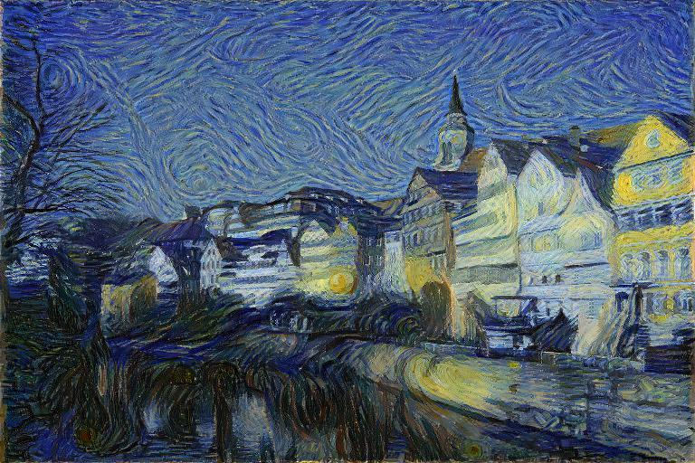

[](https://colab.research.google.com/drive/1dHAY_yCdW-u8xuZPO_S9095S98R4O2MV?usp=sharing)

# Neural Style Transfer
A PyTorch implementation of two original works in Neural Style Transfer:
* Image Style Transfer Using Convolutional Neural Networks ([Gatys et al.](https://www.cv-foundation.org/openaccess/content_cvpr_2016/papers/Gatys_Image_Style_Transfer_CVPR_2016_paper.pdf))
* Perceptual Losses for Real-Time Style Transfer and Super-Resolution ([Johnson et. al](https://arxiv.org/pdf/1603.08155.pdf))

with additional modifications to the second method to improve the quality of
stylized images produced from transformation networks.

                                                  
         
 
<figure> 
    <figcaption>
        Photo of <it>Tuebingen Neckarfront</it> by Andreas Praefcke (left) and a
        version in the style of <it>Starry Night</it> by Van Gogh (right).
    </figcaption>
</figure> 


[//]: # (<p align="center" style="margin: 0 auto;">   )

[//]: # (    )

[//]: # (    )

[//]: # (</p>)

[//]: # (<p align="center" style="margin: 0 auto">)

[//]: # (    )

[//]: # (    )

[//]: # (    )

[//]: # (</p>)

[//]: # (Stylized versions of _Tuebingen Neckarfront_ by Andreas Praefcke &#40;top left&#41;. )

## Background
Style transfer is the task of generating an image that resembles the content
or spatial information of one image, but shares the style or _look_ of another
image. Unlike other well defined image tasks, the objective with style transfer
is to strike a balance between the _content representation_ and
_style representation_ of the image that leads to visually aesthetic results.
Therefore, the success of a style transfer depends on how well an image can
be artistically reimagined without deforming the image or making it
unrecognizable.

In both methods, a pretrained CNN acts as a "loss network" by producing the
feature maps corresponding to certain layers, which are calculated for the
generated, content and style images. The loss of the generated image is
computed by weighting and combining content and style losses. In the first method,
the optimization is on the generated image directly, whereas in the second method,
a separate transformation network is trained to produce images directly. In fact,
once trained, the latter method is much faster (~1000x).

## Additions
- [ ] Finish facial preservation mechanism (MTCNN, additional loss term).
- [ ] Finish color preservation (luminance transfer)     
- [ ] Finish training transformation network on COCO for method 2.

## Requirements
* [PyTorch](https://pytorch.org/) (>=1.12.1)
* [Torchvision](https://pytorch.org/vision/stable/index.html) (>=0.13.1)
* [Pillow](https://pillow.readthedocs.io/en/stable/) (>=7.1.2)
* [Matplotlib](https://matplotlib.org/stable/index.html) (>=3.2.2)
* [Tqdm](https://tqdm.github.io/) (>=4.64.0)

## Installation                                                
Clone the repo to install:                                     
```                                                            
$ git clone https://github.com/kianzohoury/style_transfer.git  
```                                                            
and install the dependencies with the PyPi package manager:
```
$ pip install style_transfer/.
```
## Usage
### Gatys et al. Method
To run style transfer using the method outlined by Gatys et. al, execute the
following:

```
$ python3 -m style_transfer gatys \
--content-src path/to/content_img \
--style-src path/to/style_img \
--save-path path/to/output \
--num-iters 100 \
--alpha 1.0 \
--beta 100000 \
--lr 1.0 \
--tv-reg 0.00001 \
--random \
--device cuda
```

#### Options

`--content-src` (str): path to the content image

`--style-src` (str): path to the style image

`--save-path` (str): path to save the generated image

`--num-iters` (int): number of optimization steps or updates to the image

`--alpha` (float): content loss weight

`--beta` (float): style loss weight

`--lr` (float): learning rate for LBFGS optimizer

`--tv-reg` (float): total variation regularization weight

`--random` (flag): initializes the image from noise

`--device` (str): device

Optionally, the same can be achieved by calling the corresponding function
within a python script or notebook.

```python
from style_transfer import run_gatys_style_transfer

generated_image = run_gatys_style_transfer(
    content_src="henriette_mayer_van_den_bergh.jpeg",
    style_src="wassily_kandinsky_composition_VII.jpeg",
    save_path="my_style_transfer.jpg",
    image_size=(768, 640),
    num_iters=100,
    alpha=1.0,
    beta=100000,
    lr=1.0,
    tv_reg=1e-5,
    device="cuda",
    random=True
)
```

### Johnson et al. Method
- [ ] TODO

## Colab Notebook
An interactive notebook can be accessed [here](https://colab.research.google.com/drive/1dHAY_yCdW-u8xuZPO_S9095S98R4O2MV?usp=sharing).       
     

