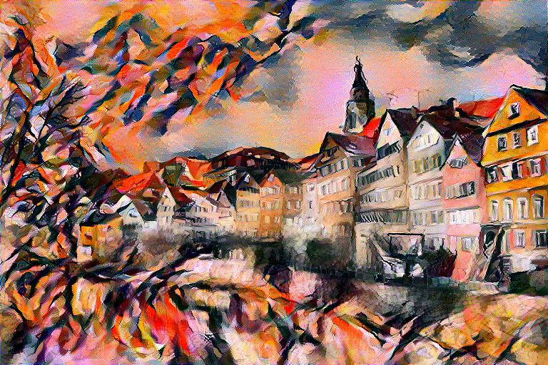
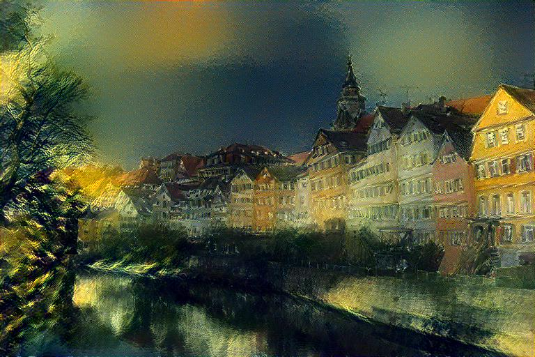
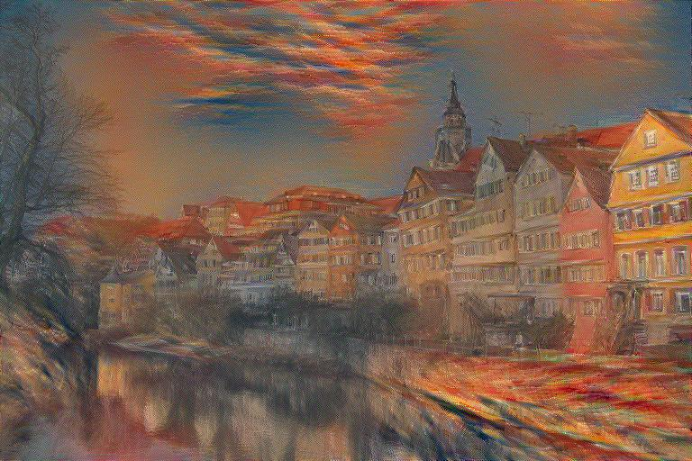
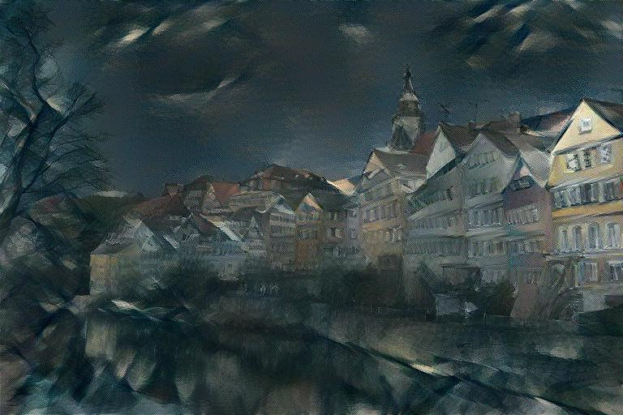
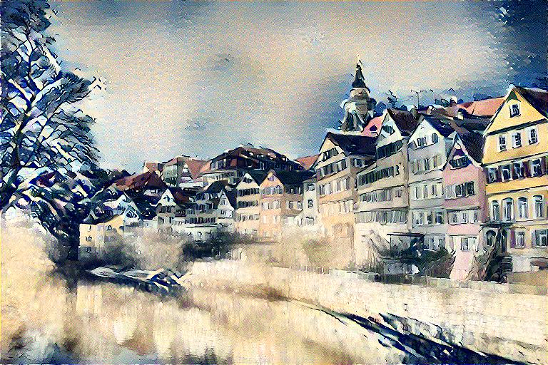

# Neural Style Transfer
A PyTorch implementation of [Image Style Transfer Using Convolutional Neural Networks](https://www.cv-foundation.org/openaccess/content_cvpr_2016/papers/Gatys_Image_Style_Transfer_CVPR_2016_paper.pdf)
with additional features.

    
    
    

    
    
    

