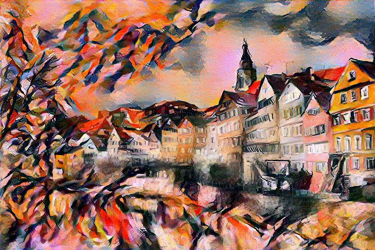
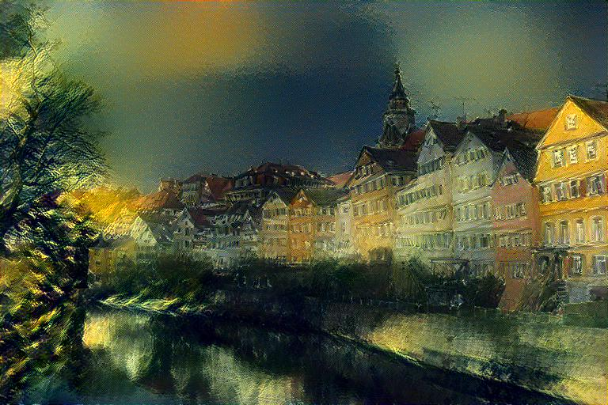
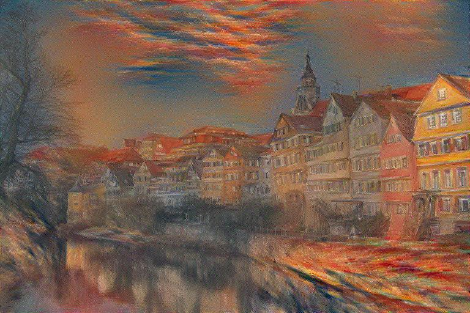
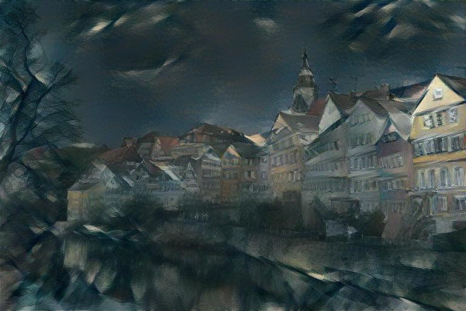

[](https://colab.research.google.com/drive/1dHAY_yCdW-u8xuZPO_S9095S98R4O2MV?usp=sharing)

# Neural Style Transfer
A PyTorch implementation of two original works in Neural Style Transfer:
* Image Style Transfer Using Convolutional Neural Networks ([Gatys et al.](https://www.cv-foundation.org/openaccess/content_cvpr_2016/papers/Gatys_Image_Style_Transfer_CVPR_2016_paper.pdf))
* Perceptual Losses for Real-Time Style Transfer and Super-Resolution ([Johnson et. al](https://arxiv.org/pdf/1603.08155.pdf))

<p float="left" style="margin: 0 auto;">
    
    
    
</p>

<p float="left" style="margin: 0 auto;">
    
    
    
</p>

## Background
Style transfer is the task of generating an image that resembles the content
information of one image while sharing the style or _look_ of another image.
Unlike other well defined image tasks, the objective with style transfer is to
find an acceptable tradeoff between the _content representation_ and
_style representation_ of the image that leads to visually aesthetic results.
With CNNs, the feature maps of the generated image can be compared against

## Install
Clone the repo to install:
```
$ git clone https://github.com/kianzohoury/style_transfer.git
```

## Usage
### Gatys Method
To run style transfer using the method outlined by Gatys et. al, execute the
following:

```
$ python3 style_transfer gatys \
--content path/to/content_img \
--style path/to/style_img \
--save path/to/output \
--iters 100 \
--alpha 1.0 \
--beta 100000 \
--lr 1.0 \
--tv-reg 0.00001 \
--device cuda \
--random
```

Optionally, the same can be achieved by calling the corresponding function
within a python script or notebook.

```python
from style_transfer import run_gatys_style_transfer

generated_image = run_gatys_style_transfer(
    content_src="henriette_mayer_van_den_bergh.jpeg",
    style_src="wassily_kandinsky_composition_VII.jpeg",
    save_path="my_style_transfer.jpg",
    image_size=(768, 640),
    num_iters=100,
    alpha=1.0,
    beta=100000,
    lr=1.0,
    tv_reg=1e-5,
    device="cuda",
    random=True
)
```


