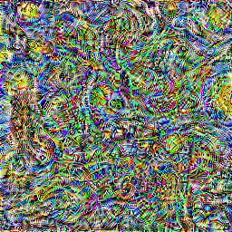

[](https://colab.research.google.com/drive/1dHAY_yCdW-u8xuZPO_S9095S98R4O2MV?usp=sharing)

# Exploring Artistic Style Transfer 🎨 🖼️
PyTorch-based implementations (from scratch) of several distinct deep learning approaches [1-3] 
that aim to solve a popular problem in computer vision called 
*style transfer*. Put simply, the task in style transfer is to generate
an image that preserves the *content* of image x (i.e. semantics, shapes, edges, etc.)
while matching the *style* of image y (i.e. textures, patterns, color, etc.). 
One may ask: what is the correct balance between content and style? As it turns
out, the answer is more subjective than typical optimization/ML problems - 
"beauty is in the eye's of the beholder", as they say. 

Create image, x on left, y on right, and gif of generated image in the middle.

## Background

[//]: # (Style transfer is the task of generating an image that resembles the content)

[//]: # (or spatial information of one image, but shares the style or _look_ of another)

[//]: # (image. Unlike other well defined image tasks, the objective with style transfer)

[//]: # (is to strike a balance between the _content representation_ and)

[//]: # (_style representation_ of the image that leads to visually aesthetic results.)

[//]: # (Therefore, the success of a style transfer depends on how well an image can)

[//]: # (be artistically reimagined without deforming the image or making it)

[//]: # (unrecognizable.)

[//]: # ()
[//]: # (In both methods, a pretrained CNN acts as a "loss network" by producing the)

[//]: # (feature maps corresponding to certain layers, which are calculated for the)

[//]: # (generated, content and style images. The loss of the generated image is)

[//]: # (computed by weighting and combining content and style losses. In the first method,)

[//]: # (the optimization is on the generated image directly, whereas in the second method,)

[//]: # (a separate transformation network is trained to produce images directly. In fact,)

[//]: # (once trained, the latter method is much faster &#40;~1000x&#41;.)

[//]: # ()
[//]: # ()
[//]: # (The twist in this form of supervised learning comes from the fact that the exact target output for each input image is not predefined. Instead, the model is trained to minimize a perceptual loss that encapsulates both content preservation and style emulation, based on high-level features extracted by a pre-trained convolutional neural network &#40;like VGG&#41;. The "supervision" comes in the form of these perceptual loss components, rather than direct input-target pairs.)

[//]: # (Generative Aspect:)

[//]: # (Johnson et al.'s method also has a generative aspect, as the transformation network generates new images that combine the content of input images with the style of the reference style images. This places the method in the realm of generative models, which are often trained with a form of supervision but focus on generating new data samples.)

[//]: # (Conclusion:)

[//]: # (While Johnson et al.'s style transfer method does not follow the traditional supervised learning paradigm with direct input-target pairs, it is still a form of supervised learning in that the model is trained to minimize a loss function defined by the desired output characteristics &#40;content and style&#41;. The method cleverly adapts supervised learning principles to meet the unique requirements of style transfer, making it a specialized but supervised approach to learning artistic style transformation.)

[//]: # ()
[//]: # ()
[//]: # ()
[//]: # (is to strike a balance between the _content representation_ and)

[//]: # (_style representation_ of the image that leads to visually aesthetic results.)

[//]: # (However, )

[//]: # (since we do not have strong supervision signals &#40;i.e. ground truth images&#41;)

[//]: # ()
[//]: # ()
[//]: # ()
[//]: # (since the optimization problem is ill-defined &#40;meaning &#41;)

[//]: # ()
[//]: # (Unlike other well defined image tasks, the objective with style transfer)

[//]: # (is to strike a balance between the _content representation_ and)

[//]: # (_style representation_ of the image that leads to visually aesthetic results.)

[//]: # (Therefore, the success of a style transfer depends on how well an image can)

[//]: # (be artistically reimagined without deforming the image or making it)

[//]: # (unrecognizable.)

[//]: # ()
[//]: # ()
[//]: # (original works in Neural Style Transfer:)

[//]: # (* Image Style Transfer Using Convolutional Neural Networks &#40;[Gatys et al.]&#40;https://www.cv-foundation.org/openaccess/content_cvpr_2016/papers/Gatys_Image_Style_Transfer_CVPR_2016_paper.pdf&#41;&#41;)

[//]: # (* Perceptual Losses for Real-Time Style Transfer and Super-Resolution &#40;[Johnson et. al]&#40;https://arxiv.org/pdf/1603.08155.pdf&#41;&#41;)

[//]: # ()
[//]: # (with additional modifications to the second method to improve the quality of)

[//]: # (stylized images produced from transformation networks.)


[//]: # (    <figure> )

[//]: # (        <figcaption style="text-align: left;">)

[//]: # (            Photo of <i>Tuebingen Neckarfront</i> by Andreas Praefcke &#40;left&#41; and a)

[//]: # (            version generated in the style of <i>Starry Night</i> by Van Gogh &#40;right&#41;.)

[//]: # (        </figcaption>)

[//]: # (    </figure> )
[//]: # (</div>)

[//]: # (<p align="center" style="margin: 0 auto;">   )

[//]: # (    )

[//]: # (    )

[//]: # (</p>)

[//]: # (<p align="center" style="margin: 0 auto">)

[//]: # (    )

[//]: # (    )

[//]: # (    )

[//]: # (</p>)

[//]: # (Stylized versions of _Tuebingen Neckarfront_ by Andreas Praefcke &#40;top left&#41;. )


## Additions
- [ ] Finish facial preservation mechanism (MTCNN, additional loss term).
- [ ] Finish color preservation (luminance transfer)     
- [ ] Finish training transformation network on COCO for method 2.

## Colab Notebook
An interactive notebook can be accessed [here](https://colab.research.google.com/drive/1dHAY_yCdW-u8xuZPO_S9095S98R4O2MV?usp=sharing).

## Requirements
* [PyTorch](https://pytorch.org/) (>=1.12.1)
* [Torchvision](https://pytorch.org/vision/stable/index.html) (>=0.13.1)
* [Pillow](https://pillow.readthedocs.io/en/stable/) (>=7.1.2)
* [Matplotlib](https://matplotlib.org/stable/index.html) (>=3.2.2)
* [Tqdm](https://tqdm.github.io/) (>=4.64.0)

## Installation                                                
Clone the repo to install:                                     
```                                                            
$ git clone https://github.com/kianzohoury/style_transfer.git  
```                                                            
and install the dependencies with the PyPi package manager:
```
$ pip install style_transfer/.
```
## Usage
### Method I: Slow optimization
Unlike the other methods, Gatys et al. [1] proposed optimization directly on
images themselves. In this manner, the pixels of an image are considered 
parameters, and "training" involves updating the pixel values rather than
a neural network's parameters.

<div align="center" style="margin: 0 auto;">
       
    
    
    
</div>

<div align="center" style="margin: 0 auto;">
    
    
    
    
</div>
<div align="center" style="margin: 0 auto;">
    
    
    
    
</div>
<div align="center" style="margin: 0 auto;">
    
    
    
    
</div>
<div align="center" style="margin: 0 auto;">
    <div>
         
         
         
    </div>
    <figure> 
        <figcaption style="text-align: left;">
            Stylized images using (1) <i>Starry Night</i> by Van Gogh, (2)
            <i>Girl with a Mandolin</i> by Pablo Picasso, and (3)
            <i> Sky and Water</i> by MC Escher. 
        </figcaption>
    </figure> 
</div>

To run this method from the command line, cd into `/style_transfer` and
execute the following:

```
python -m stylize gatys --content-src <content path> --style-src <style path> 
```
Optionally, the same can be achieved by calling `stylize.run_gatys_optimization()`:
```python
from stylize import run_gatys_optimization

stylized_img = run_gatys_optimization(
    content_src="examples/content/tuebingen_neckarfront.jpeg",
    style_src="examples/style/van_gogh_starry_night.jpeg",
    ...
)
```

#### Options
Some of the important options are described below:

[//]: # ()
[//]: # (`--content-src` &#40;str&#41;: Path to content image.)

[//]: # ()
[//]: # (`--style-src` &#40;str&#41;: Path to style image.)

[//]: # ()
[//]: # (`--image-size` &#40;tuple or int&#41;: Shape to resize images. Default: &#40;512, 512&#41;.)

[//]: # ()
[//]: # (`--center-crop` &#40;tuple or int&#41;: Whether to center crop images. Default: True.)

[//]: # ()
[//]: # (`--content-labels` &#40;list, str, optional&#41;: Layers to calculate content )

[//]: # (losses from. If None is specified, content representation layers are ignored; )

[//]: # (otherwise, default layers are chosen.)

[//]: # ()
[//]: # (`--style-labels` &#40;list, str, optional&#41;: Layers to calculate style losses)

[//]: # (from. If None is specified, style representation layers are ignored; otherwise, )

[//]: # (default layers are chosen.)

`--content-weight` (float): Content loss weight. Default: 1.0.

`--style-weight` (float): Style loss weight. Default: 1e6.

`--tv-weight` (float): Total variation regularization weight. Default: 1e-6.

`--lbfgs-iters` (int): Max number of L-BFGS iterations per optimization step. 
Default: 10.

`--num-steps` Number of image optimizations, resulting in a maximum of 
`lbfgs_iters` * `num_steps` total L-BFGS iterations. Default: 50.

`--lr` (float): Learning rate for L-BFGS optimizer. Default: 1e-3.

`--init-noise` (bool): Initializes generated image with noise. Default: False.

`--save-fp` (str, optional): Path to save generated image, using a valid format 
(e.g. jpg, tiff). Default: None.

`--save-gif` If True, saves a .gif version of the image saved under `save_fp`. 
    Default: False.

Refer to the method signature of `stylize.run_gatys_optimization()` for the full list of options.
### Feature Inversion
As an aside, feature inversion can be conducted when no content
labels are passed in, and only a single style label is passed in. Starting
from a noise image, the image is optimized to match a single style
layer, and the result will look like a texture image. Texture paper by Gatys et al. [add citation].
<div align="center" style="margin: 0 auto;">
    
    
    
    
    <figure> 
        <figcaption style="text-align: left;">
            Reconstructed features from VGG16 activations layers (1) conv_1_2,
            (2) conv_2_2, (3) conv_3_3, and (4) conv_4_4. The images illustrate
            that deeper layers capture style more globally.
        </figcaption>
    </figure> 
</div>

### Method II: Transformation networks
Johnson et al. [2] proposed a transformation network, which is significantly 
faster than Method I (~1000x) faster for 256 x 256 images. However, the major
drawback with this method is that a transformation network must be trained 
separately for each style.

     
### References
[1] L. A. Gatys, A. S. Ecker, and M. Bethge, "Image Style Transfer Using Convolutional Neural Networks," in *Proceedings of the IEEE Conference on Computer Vision and Pattern Recognition (CVPR)*, 2016, pp. 2414-2423. [DOI](https://doi.org/10.1109/CVPR.2016.265)

[2] J. Johnson, A. Alahi, and L. Fei-Fei, "Perceptual Losses for Real-Time Style Transfer and Super-Resolution," in *Proceedings of the European Conference on Computer Vision (ECCV)*, 2016, pp. 694-711. [DOI](https://doi.org/10.1007/978-3-319-46475-6_43)

[3] J.-Y. Zhu, T. Park, P. Isola, and A. A. Efros, "Unpaired Image-to-Image Translation using Cycle-Consistent Adversarial Networks," in *Proceedings of the IEEE International Conference on Computer Vision (ICCV)*, 2017, pp. 2223-2232. [DOI](https://doi.org/10.1109/ICCV.2017.244)

